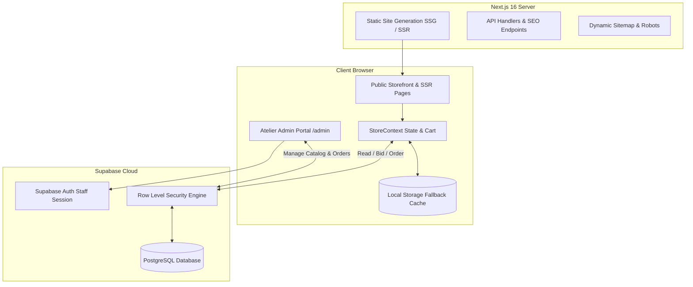

# INDIE SUMMER — ONE DESIGN. ONE PIECE. NEVER AGAIN.

> *"We create one piece of each design, crafted from vintage Indian sarees, dupattas and handworked textiles. Once it’s gone, that exact piece will never exist again.*  
> *Some carry intricate handwork. Some carry faded colours. Some show the marks of another time. And that’s exactly what makes them beautiful.*  
> *Slow batches. Singular pieces. Zero waste. A second life for beautiful things."*

---

## 1. Executive Summary

**INDIE SUMMER** is an archival luxury e-commerce platform built on **Next.js 16 (App Router)** and **React 19**, powered by a **Supabase PostgreSQL** backend with strict **Row-Level Security (RLS)**.

Inspired by premier minimalist fashion labels (such as [azarthelabel.com](https://azarthelabel.com/)), the experience emphasizes slow intentional craftsmanship, authentic Indian textile provenance (Varanasi Banarasi silk, Tamil Nadu brocades, Rajasthan handloom, and Bagru natural indigo), and sustainable zero-waste silhouettes.

---

## 2. Technical Stack

* **Framework:** Next.js 16.3 (Turbopack, React Server Components & App Router)
* **Frontend:** React 19, Vanilla CSS Design System (no Tailwind dependencies)
* **Typography:** Fraunces Serif, Space Grotesk, Anton, Plus Jakarta Sans
* **Database & Auth:** Supabase (PostgreSQL, Row-Level Security, Auth)
* **State Management:** React Context (`StoreContext`) with optimistic updates and unified local storage fallback (`src/lib/orderStorage.js`)
* **Observability:** Centralized error logging (`src/lib/logger.js`) with React 19 error boundaries (`error.jsx`, `global-error.jsx`)
* **Icons & Effects:** Lucide React, Canvas-Confetti

---

## 3. System Architecture & Topology



---

## 4. End-to-End Data Flow

### A. Catalog Hydration
1. At build time, Next.js statically pre-renders all product routes (`/product/[id]`) using `src/data/products.js`.
2. When a visitor arrives, `StoreContext` checks the live Supabase `products` table. If configured, live PostgreSQL inventory overrides static data; if offline or unconfigured, it seamlessly falls back to local data.
3. Every garment is guaranteed **1-of-1**: when purchased, its status transitions to `"sold"` across the storefront.

### B. Live Atelier Auctions & Bidding Portal
1. Select archival relics feature live auction bidding with real-time countdown deadlines (`products.auction_end_time`).
2. Patrons submit offers on `/product/[id]`. The engine enforces a **minimum ₹500 increment** over the leading bid.
3. Bids are written to Supabase `public.bids` and update `products.current_bid_inr` and `products.bids_count`.
4. **Countdown Expiration & Lockout:** When `Date.now() >= auction_end_time`, the client displays `AUCTION CONCLUDED`, disables quick bid pills, disables custom inputs, and blocks bid submission.
5. When atelier staff clicks **"Award Piece & Close Auction"** in `/admin`:
   * The winning bid and bid count are **preserved** (never wiped to 0).
   * The relic is marked `status: "reserved"`.
   * A settlement order (`AUC-WIN-XXXX`) is automatically generated in `public.orders` so the atelier can issue invoices and prepare express transit.

### C. Checkout, Tax & Payment Gateway Lifecycle (Razorpay)
1. Customer enters dispatch coordinates in `CheckoutModal.jsx`.
2. **Dynamic Indian Handloom GST Calculation:**
   * Automatically derives Net Silhouette Value (`Math.round(total / 1.05)`) and 5% Handloom GST.
   * Splits tax lines by destination: **Intra-State (Goa)**: 2.5% CGST + 2.5% SGST; **Inter-State**: 5.0% IGST.
   * Complimentary express air routing via BlueDart (2–3 business days).
3. **Two-Phase Cryptographic Payment Authorization:**
   * Client calls `/api/payment/create-order` with the calculated cart total in paise.
   * Opens the official Razorpay Checkout SDK (supporting UPI, Google Pay, PhonePe, Cards, Netbanking).
   * Upon successful payment, client posts the payment credentials to `/api/payment/verify` for server-side HMAC-SHA256 signature verification.
   * **Inventory Protection:** Orders are persisted to `public.orders` and 1-of-1 relics marked `"sold"` **only after cryptographic payment verification passes**. If payment is abandoned or fails, the relic remains available.
4. The client receipt offers **"Print Invoice & Provenance"** and direct **"Track Order"** actions.

### D. Order Tracking & Privacy (`/track`)
1. Patrons track parcels via `/track`.
2. **Privacy Protection:** Requires **both** the exact Order Reference (`IS-IND-XXXXXX`) **and** matching email or phone.
3. Full physical street addresses are masked to protect customer privacy on public screens.
4. Renders a live 4-step dispatch progression (*Acquisition Confirmed* → *Provenance Packaging* → *BlueDart Air Dispatch* → *Delivered to Patron*).

### E. Atelier Operations & Admin CMS (`/admin`)
1. **Authentication Gate:** Locked behind Supabase Auth (`/admin/login`). Unauthenticated requests bounce immediately.
2. **Live Tabs:**
   * **Overview & Revenue:** Real-time Gross Revenue, AOV, drop acquisition velocity, fulfillment rate, and recent transactions feed.
   * **Orders:** Full dispatch workflow (`confirmed` → `dispatched` → `delivered` → `cancelled`) with CSV export for BlueDart courier manifests.
   * **Patrons CRM:** Aggregates unique clients, lifetime spend (LTV in ₹), past acquisitions, and direct 1-click WhatsApp/Email concierge links.
   * **Live Auctions:** Inspects individual bid ledgers and executes auction awards.
   * **Relics Catalog:** Introduces new 1-of-1 relics with client-side canvas compression (1600px, 85% JPEG) and direct uploads to Supabase Storage CDN (`product-images`).
   * **Customization:** Edits hero headlines, running marquee ticker, drop status, and active promo discounts live.

---

## 5. Database Schema & Security (Supabase PostgreSQL)

Execute [supabase_schema.sql](file:///D:/Ddeveloped_things/indie%20summer/supabase_schema.sql) in your [Supabase SQL Editor](https://supabase.com/dashboard/project/gqvmdrtlocvidjtiyycv/sql):

| Table | Purpose | Public Policy | Staff Policy (Authenticated) |
| :--- | :--- | :--- | :--- |
| `products` | 1-of-1 relics & auction items | `SELECT USING (true)` | `ALL TO authenticated` (Full CRUD) |
| `bids` | Archival offers & ledgers | `SELECT`, `INSERT WITH CHECK (amount > 0)` | `ALL TO authenticated` (Full CRUD) |
| `orders` | Customer acquisitions & PII | `INSERT WITH CHECK (valid ref & name)` | `ALL TO authenticated` (Restricted view/edit) |
| `site_settings` | Marquee, headlines, promo codes | `SELECT USING (true)` | `ALL TO authenticated` (Full CRUD) |
| `error_logs` | Observability runtime exceptions | `INSERT WITH CHECK (true)` | `SELECT TO authenticated` (Staff review) |

---

## 6. Environment Variables (`.env.local`)

Create `.env.local` in the project root:

```ini
# Supabase Database & Auth (Project: gqvmdrtlocvidjtiyycv)
NEXT_PUBLIC_SUPABASE_URL=https://gqvmdrtlocvidjtiyycv.supabase.co
NEXT_PUBLIC_SUPABASE_ANON_KEY=your_supabase_anon_key_here

# Optional: Sentry Error Monitoring DSN
# NEXT_PUBLIC_SENTRY_DSN=https://your-dsn@sentry.io/project
```

> [!WARNING]
> **Key Rotation Notice:** If you ever commit a key to version control, rotate it immediately in the Supabase Dashboard under *Project Settings → API → Regenerate Anon Key*.

---

## 7. Development & Production Runbook

### Prerequisites
* Node.js `v18.17+` (recommended: Node 20 or 22)
* npm or yarn

### Installation
```bash
git clone https://github.com/AnandBinuArjun/Indie_Summer.git
cd Indie_Summer
npm install
```

### Local Development Server
```bash
npm run dev
# Server listening at http://localhost:3000
```

### Production Build & Static Validation
```bash
npm run build
# Compiles all 24 static and dynamic routes via Turbopack
npm start
```

---

## 8. Directory Structure

```
├── src/
│   ├── app/
│   │   ├── admin/             # Atelier control portal & staff login
│   │   ├── product/[id]/      # 1-of-1 relic showcase & live bidding engine
│   │   ├── shop/              # Catalog archive with category/auction filtering
│   │   ├── track/             # Secured 2-factor dispatch tracking portal
│   │   ├── privacy/           # DPDPA 2023 compliant privacy policy
│   │   ├── terms/             # Auction & handloom terms of service
│   │   ├── shipping-returns/  # Pan-India insured air courier policy
│   │   ├── sitemap.js         # Dynamic search engine sitemap
│   │   ├── robots.js          # Bot indexing directives
│   │   ├── error.jsx          # Client-side exception boundary
│   │   ├── global-error.jsx   # Root layout fatal crash boundary
│   │   └── layout.jsx         # Root layout with fonts & cookie consent
│   ├── components/            # Cart drawer, checkout, modals, navbar, footer
│   ├── context/               # StoreContext global state & Supabase sync
│   ├── data/                  # Seed catalog (products.js)
│   └── lib/                   # Supabase client, logger, and orderStorage
├── supabase_schema.sql        # Canonical DDL schema & Row Level Security
└── README.md                  # Project documentation
```

---

## 9. License

© INDIE SUMMER ATELIER. All rights reserved. One Design. One Piece. Never Again.
